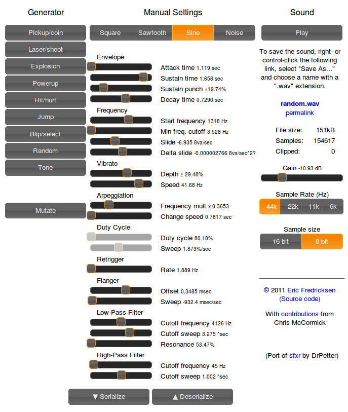

Quick 'n' easy game sound effects generator.

App 👉 https://sfxr.me

[About](#about) | [Library](#library)

# About

A port of [sfxr](http://www.drpetter.se/project_sfxr.html) to HTML5 by Eric Fredricksen.
Maintained by Chris McCormick.



# Library

You can use the jsxfr library to play sounds in your JavaScript game code.

## Node

Install it:

```
npm i @chr15m/jsfxr
```

Require it:

```
const SoundEffect = require("jsfxr").SoundEffect;
```

See [API](#API) below for usage examples.

## Browser

Include the scripts in your page:

```
<script src="https://sfxr.me/riffwave.js"></script>
<script src="https://sfxr.me/sfxr.js"></script>
```

## API

Once you find a nice sound, click the Serialize button and copy the JSON code for the sound::

        var sound = {
          "oldParams": true,
          "wave_type": 1,
          "p_env_attack": 0,
          "p_env_sustain": 0.31718502829007483,
          "p_env_punch": 0,
          "p_env_decay": 0.2718540993592685,
          "p_base_freq": 0.2612<F2>6191208337196,
          "p_freq_limit": 0,
          "p_freq_ramp": 0.43787689856926615,
          "p_freq_dramp": 0,
          "p_vib_strength": 0,
          "p_vib_speed": 0,
          "p_arp_mod": 0,
          "p_arp_speed": 0,
          "p_duty": 1,
          "p_duty_ramp": 0,
          "p_repeat_speed": 0.7558565452384385,
          "p_pha_offset": 0,
          "p_pha_ramp": 0,
          "p_lpf_freq": 1,
          "p_lpf_ramp": 0,
          "p_lpf_resonance": 0,
          "p_hpf_freq": 0,
          "p_hpf_ramp": 0,
          "sound_vol": 0.25,
          "sample_rate": 44100,
          "sample_size": 8
        };
        
        var s = new SoundEffect(sound).generate();
        // returns a webaudio object if supported, or an Audio object
        s.getAudio().play();

You can also use the short URL compressed version of the sound::

        var s = new SoundEffect("5EoyNVSymuxD8s7HP1ixqdaCn5uVGEgwQ3kJBR7bSoApFQzm7E4zZPW2EcXm3jmNdTtTPeDuvwjY8z4exqaXz3NGBHRKBx3igYfBBMRBxDALhBSvzkF6VE2Pv").generate();
        s.getAudio().play();

You can also access an array of samples if you want to use the WebAudio API to play the sound::

        console.log(s.buffer)

You can find more example code for using the WebAudio API on lines 55 and 81 of the index.html file.

* 55: https://github.com/chr15m/jsfxr/blob/master/index.html#L55
* 81: https://github.com/chr15m/jsfxr/blob/master/index.html#L81
* index.html: https://github.com/chr15m/jsfxr/blob/master/index.html

# links

* Application:  http://sfxr.me/
* Source code:  https://github.com/chr15m/jsfxr/

# Thanks

* Dr. Petter for inventing sfxr.
* Eric Fredricksen for creating this port.
* riffwave.js: http://www.codebase.es/riffwave/
* jquery-ui:   http://jqueryui.com/
